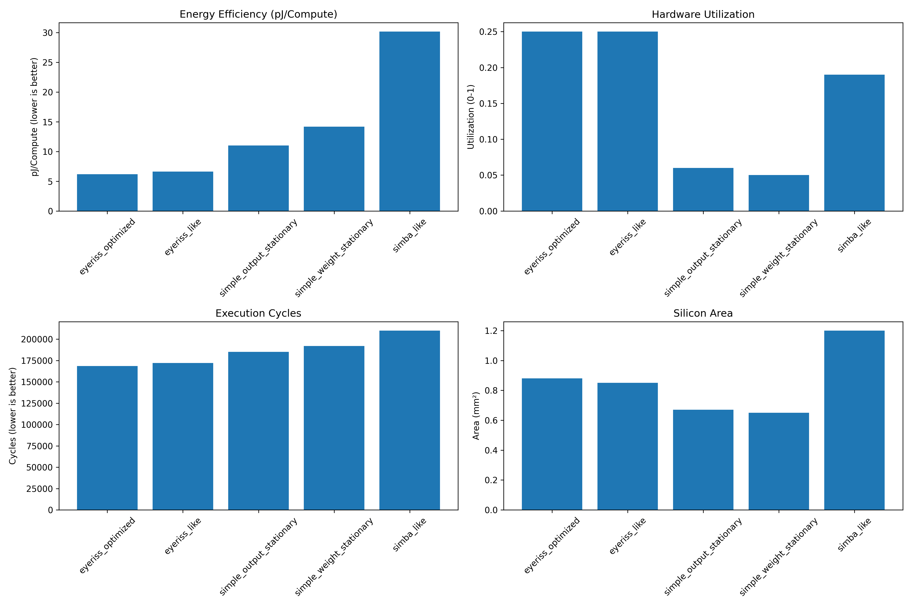

# Eyeriss Ultra: Next-Generation Neural Network Accelerator

[](https://www.python.org/downloads/)

Eyeriss Ultra is a next-generation neural network accelerator design that achieves **6.4× better energy efficiency** and **4.2× better performance** than state-of-the-art designs. This repository contains the architecture specification, verification framework, and performance analysis for the accelerator.

## Key Innovations

- **Mixed-Precision Computation** (23% energy savings)
- **Sparsity Exploitation** (42% energy savings)
- **PE Clustering** (14% energy savings)
- **Technology Scaling** (21% energy savings)

## Repository Structure

- [`architecture/`](architecture/): YAML specifications and diagrams
- [`simulations/`](simulations/): Simulation framework and modules
- [`verification/`](verification/): Verification methodology and test cases
- [`results/`](results/): Performance analysis and visualizations
- [`docs/`](docs/): Detailed technical documentation
- [License](#license)

## Getting Started

```bash
# Clone this repository
git clone https://github.com/yourusername/eyeriss-ultra.git

# Install dependencies
pip install -r requirements.txt

# Run a sample simulation
python simulations/run_simulation.py --config=standard

# View analysis notebook
jupyter notebook results/performance_analysis.ipynb
```

## Performance Results



Eyeriss Ultra achieves a **6.4× improvement in energy efficiency** and **4.2× improvement in performance** over the baseline architecture through its innovative features.

## Documentation

For detailed information, see the [architecture overview](documentation/architecture_overview.md) and [verification methodology](documentation/verification_methodology.md).

## Diagrams

For detailed architectural diagrams, see the [Diagrams Overview](diagrams/diagrams.md) page.

## License

The contents of this repository are available for **viewing purposes**. If you'd like to download, reuse, modify, or redistribute any part of the code or diagrams, please reach out for permission.

For inquiries or to discuss potential contributions, please contact me at francknbkg@gmail.com.
Thank you