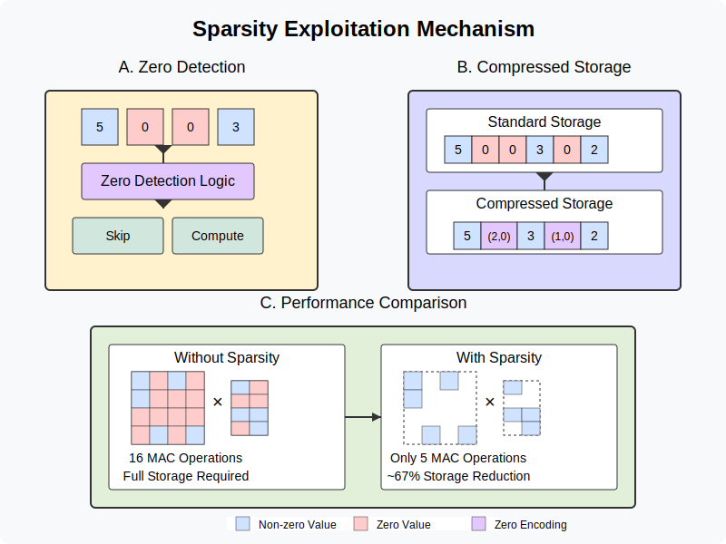

# Diagrams

## Contribution of Optimizations

*Diagram showing the contribution of various optimizations.*

## Energy Breakdown by Component

*Diagram detailing how energy consumption is distributed among components.*

## Energy Efficiency Performance Comparison

*Comparison of energy efficiency and performance across designs.*

## Eyeriss Ultra-Architecture Overview

*Overview of the Eyeriss Ultra accelerator architecture.*

## Mixed Precision Arithmetic Unit

*Diagram of the mixed precision arithmetic unit design.*

## Mixed Precision Energy Benefits

*Illustration of the energy benefits from using mixed precision.*

## PE Cluster Organization

*Diagram outlining the organization of processing element clusters.*

## PE Clustering Benefits and Overheads

*Analysis of the benefits and overheads of clustering processing elements.*

## Scalability Analysis

*Diagram providing insights into scalability aspects of the architecture.*

## Simulation Framework

*Overview of the simulation framework used for evaluations.*

## Sparsity Exploitation Mechanism

*Diagram illustrating how sparsity is exploited within the design.*

## Technology Scaling Benefits

*Illustration of performance and energy benefits due to technology scaling.*

## Workload-Specific Optimization Benefits

*Diagram that highlights the benefits of workload-specific optimizations.*