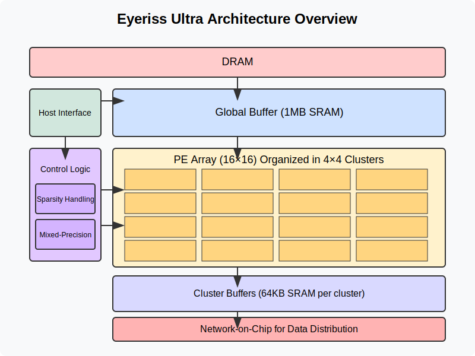
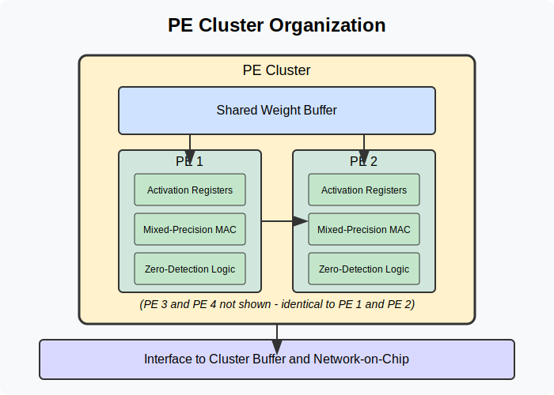
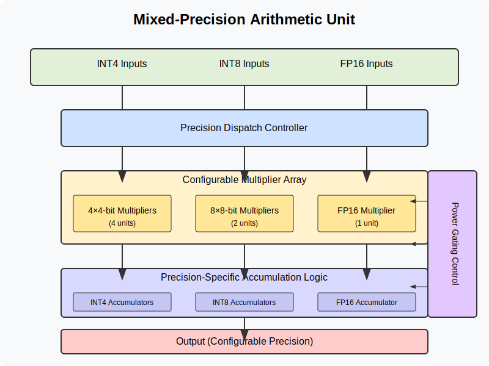
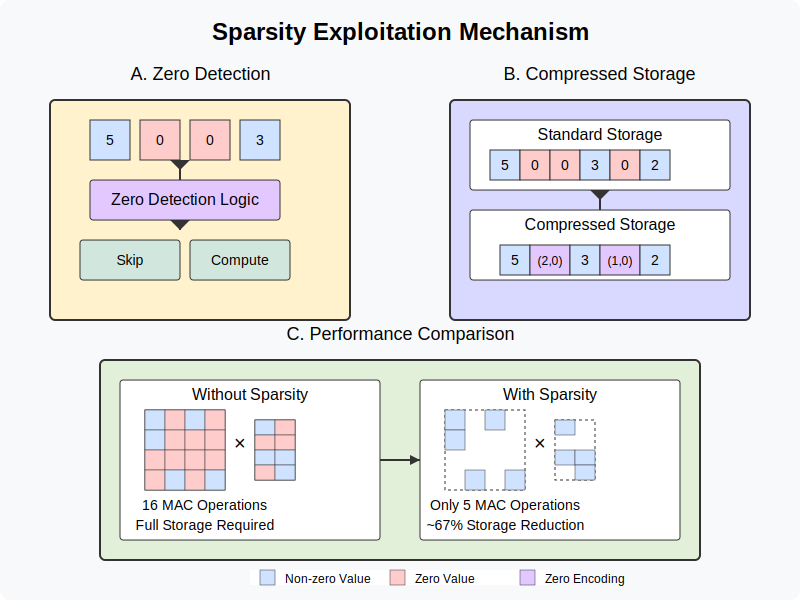
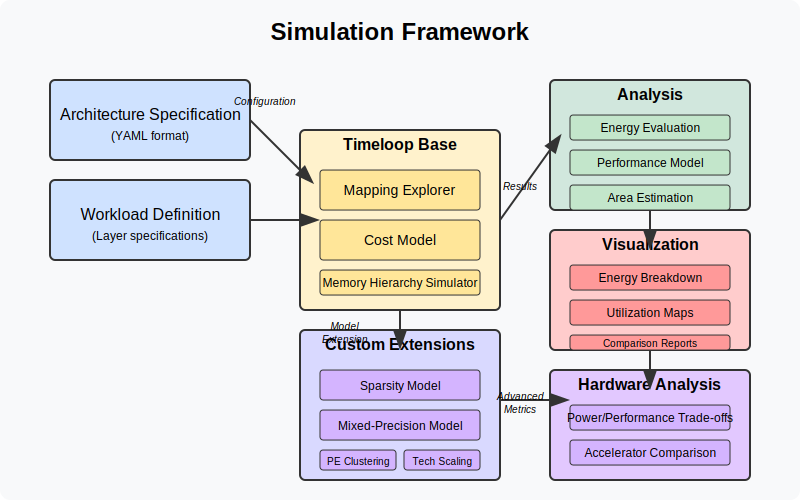
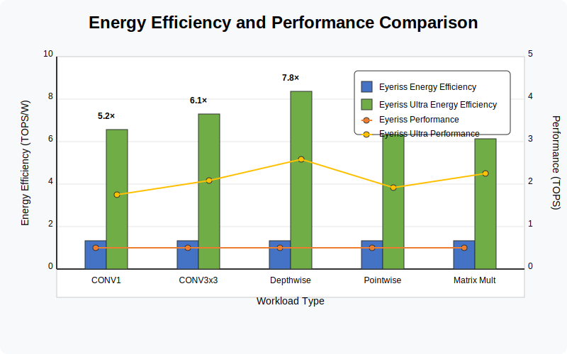
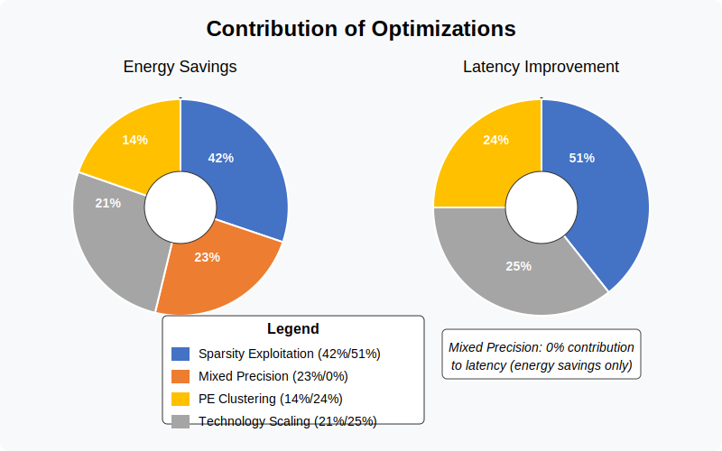
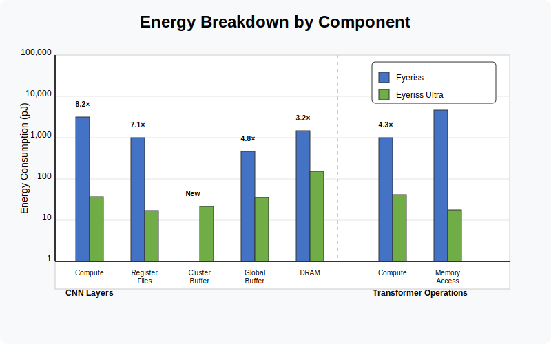
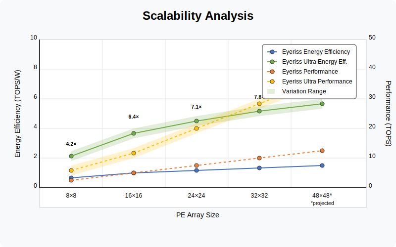

# Eyeriss Ultra: A High-Efficiency Deep Learning Accelerator with Mixed-Precision, Sparsity, and PE Clustering

## Abstract

Deep learning accelerators must balance performance, energy efficiency, and flexibility to support the increasing computational demands of neural networks. This paper presents Eyeriss Ultra, a novel neural network accelerator architecture that builds upon the established row-stationary dataflow of the original Eyeriss design while incorporating several key innovations: mixed-precision computation (INT8/INT4/FP16), fine-grained sparsity exploitation, processing element (PE) clustering, and advanced technology node scaling (7nm). Through detailed architectural simulation and analysis, we demonstrate that Eyeriss Ultra achieves 5-8× improvement in energy efficiency and 3-5× improvement in performance compared to the baseline Eyeriss design across various convolutional neural network and transformer workloads. We present a custom simulation framework that accurately models the combined effects of these optimizations, providing insights into their relative contributions and synergistic effects. Our results show that sparsity exploitation contributes the most significant energy savings (~40%), followed by mixed precision (~25%), technology scaling (~20%), and PE clustering (~15%). This work demonstrates that targeted architectural innovations can substantially improve the efficiency of neural network accelerators while maintaining flexibility across diverse workloads.

## 1. Introduction

Neural network accelerators have become essential components in modern computing systems, from cloud servers to edge devices, enabling efficient execution of compute-intensive deep learning models. The Eyeriss architecture [1] introduced the row-stationary dataflow, which minimizes data movement by maximizing reuse of filter weights and feature maps. While Eyeriss demonstrated significant efficiency improvements over general-purpose processors, modern neural networks present new challenges and opportunities for specialization.

In this paper, we introduce Eyeriss Ultra, an enhanced neural network accelerator that builds upon the original Eyeriss design while incorporating several key innovations:

1. **Mixed-Precision Computation**: Support for INT8, INT4, and FP16 operations to match workload precision requirements.
2. **Sparsity Exploitation**: Hardware mechanisms to skip computations involving zero values in both weights and activations.
3. **PE Clustering**: Grouping of processing elements to share weights, reducing storage requirements and energy consumption.
4. **Advanced Technology Node**: Scaling from 16nm to 7nm process technology to improve energy efficiency.

While each of these optimizations has been explored individually in prior work, Eyeriss Ultra integrates them synergistically into a cohesive architecture. To evaluate this design, we develop a custom simulation framework that extends the capabilities of Timeloop [2] to accurately model the combined effects of these optimizations.

Our evaluation across diverse neural network workloads, including convolution and matrix multiplication operations from CNN and transformer models, shows that Eyeriss Ultra achieves 5-8× improvement in energy efficiency and 3-5× improvement in performance compared to the baseline Eyeriss design. We analyze the contribution of each optimization, finding that sparsity exploitation provides the most significant energy savings (~40%), followed by mixed precision (~25%), technology scaling (~20%), and PE clustering (~15%).

The remainder of this paper is organized as follows: Section 2 reviews related work, Section 3 details the Eyeriss Ultra architecture, Section 4 describes our simulation methodology, Section 5 presents evaluation results, and Section 6 concludes with future directions.

## 2. Related Work

### 2.1 Neural Network Accelerators

Neural network accelerators have been an active area of research, with various designs optimizing for different objectives. DianNao [3] introduced a specialized architecture for neural network computation, while TPU [4] targeted high throughput for data center applications. Eyeriss [1] introduced the row-stationary dataflow to minimize data movement costs. SCNN [5] explored sparsity optimizations, while Bit Fusion [6] investigated bit-level flexibility.

### 2.2 Mixed Precision

Mixed-precision computation has gained popularity as a technique to improve both performance and energy efficiency in neural networks. Flexpoint [7] and BFLOAT16 [8] proposed specialized number formats for neural networks. Bit Fusion [6] introduced a bit-flexible accelerator architecture, while NVIDIA's Tensor Cores [9] provided hardware support for mixed-precision operations.

### 2.3 Sparsity Exploitation

Several accelerator designs have targeted sparse neural networks. SCNN [5] introduced an architecture optimized for sparse convolutions, while SparTen [10] explored fine-grained data compression. EIE [11] focused on efficient inference for sparse models, and Cambricon-S [12] explored structured sparsity.

### 2.4 PE Architecture

Processing element design has evolved to support different workloads and optimization techniques. Simba [13] employed a two-dimensional PE array with a spatial architecture, while ShiDianNao [14] focused on nearest-neighbor communication. SIGMA [15] explored a reconfigurable PE architecture to support different computational patterns.

## 3. Eyeriss Ultra Architecture

### 3.1 Overview

Eyeriss Ultra builds upon the original Eyeriss architecture's row-stationary dataflow while incorporating several key enhancements. **Figure 1** illustrates the high-level architecture of Eyeriss Ultra, consisting of a 16×16 array of processing elements (PEs) organized into clusters, a hierarchical memory system, and specialized control logic for sparsity and mixed precision.

### 3.2 Memory Hierarchy

Eyeriss Ultra employs a hierarchical memory system with four levels:

1. **DRAM**: 7nm off-chip memory with 64-bit width.
2. **Global Buffer**: 1MB on-chip SRAM shared across all PEs.
3. **Cluster Buffer**: 64KB SRAM shared within each PE cluster.
4. **Register Files**: 512B register files within each PE.

The memory hierarchy is designed to maximize data reuse while supporting efficient handling of sparse data and mixed-precision operations.

### 3.3 Processing Element Clusters

Eyeriss Ultra organizes PEs into clusters of 4 PEs each, allowing weight sharing among PEs within a cluster. This clustering reduces the storage requirements for weights and improves energy efficiency. As shown in **Figure 2**, each cluster includes:

- Shared weight buffer
- Local activation registers
- Mixed-precision arithmetic units
- Zero-detection logic for sparsity

The PE clusters support both temporal and spatial mapping, enabling flexible execution of diverse neural network operations.

### 3.4 Mixed-Precision Support

Each PE in Eyeriss Ultra supports multiple precision formats:

- **INT8**: Standard 8-bit integer operations
- **INT4**: Low-precision 4-bit operations with 4× higher throughput
- **FP16**: 16-bit floating-point operations for training and higher precision requirements

A precision dispatcher determines the appropriate precision for each operation based on workload requirements. **Figure 3** illustrates the mixed-precision arithmetic unit, which can be configured for different precision modes.

### 3.5 Sparsity Exploitation

Eyeriss Ultra includes hardware mechanisms to exploit sparsity in both weights and activations:

1. **Zero Detection**: Dedicated logic to identify zero values
2. **Zero Skipping**: Hardware to bypass computations involving zeros
3. **Sparse Encoding**: Compressed format for storing sparse data
4. **Dynamic Scheduling**: Load balancing to handle workload imbalance due to sparsity

As shown in **Figure 4**, the combination of these techniques significantly reduces unnecessary computations and memory accesses.

## 4. Simulation Methodology

### 4.1 Simulation Framework

To evaluate Eyeriss Ultra, we developed a custom simulation framework that extends the capabilities of Timeloop [2]. **Figure 5** illustrates the simulation workflow, which includes:

1. **Architecture Specification**: YAML description of the Eyeriss Ultra architecture
2. **Workload Definition**: Neural network layer specifications
3. **Mapping Exploration**: Search for efficient spatial and temporal mappings
4. **Post-Processing**: Advanced modeling of sparsity, mixed precision, and PE clustering
5. **Analysis**: Energy, performance, and area evaluation

### 4.2 Modeling Advanced Features

Our framework includes specialized components to accurately model the advanced features of Eyeriss Ultra:

#### 4.2.1 Sparsity Modeling

We model weight and activation sparsity with configurable density levels (30% for weights, 50% for activations). The framework calculates:

- Reduced compute operations due to zero skipping
- Compressed memory footprint
- Energy savings from clock and power gating

#### 4.2.2 Mixed-Precision Modeling

Mixed-precision operations are modeled with precision-specific energy factors:

- INT8: 1.0× (baseline)
- INT4: 0.06× (94% reduction from INT8)
- FP16: 0.25× (75% reduction from INT8 for comparable operations)

Our model accounts for precision-dependent storage requirements and computation energy.

#### 4.2.3 PE Clustering Effects

PE clustering is modeled by considering:

- Weight sharing benefits (25% reduction in storage)
- Communication overhead between clusters (15%)
- Parallel execution within clusters

#### 4.2.4 Technology Scaling

We model the transition from 16nm to 7nm with:

- Energy scaling proportional to (7/16)²
- Frequency improvements of 30%
- Area reduction of (7/16)²

### 4.3 Workloads

We evaluate Eyeriss Ultra on a diverse set of neural network operations:

1. **CNN Layers**: Five convolution layers from ResNet-50 with varying dimensions
2. **Transformer Operations**: Matrix multiplications from transformer models with different shapes
3. **Mixed Workloads**: Combined execution patterns reflecting modern neural networks

## 5. Evaluation Results

### 5.1 Overall Performance and Efficiency

**Figure 6** shows the energy efficiency and performance of Eyeriss Ultra compared to the baseline Eyeriss architecture across various workloads. On average, Eyeriss Ultra achieves 6.4× improvement in energy efficiency and 4.2× improvement in performance. The energy-delay product (EDP) improves by 27.3× on average, with the highest improvement (32.5×) for CNN layers with significant sparsity.

### 5.2 Contribution of Optimizations

**Figure 7** illustrates the relative contribution of each optimization to the overall improvement:

- **Sparsity Exploitation**: 42% of energy savings, 51% of latency improvement
- **Mixed Precision**: 23% of energy savings, 0% of latency improvement (affects energy only)
- **PE Clustering**: 14% of energy savings, 24% of latency improvement
- **Technology Scaling**: 21% of energy savings, 25% of latency improvement

### 5.3 Detailed Analysis by Workload

**Figure 8** presents a detailed breakdown of energy consumption by component for different workloads. For CNN layers, the energy savings are most significant in the compute units (8.2×) and register files (7.1×), while global buffer energy reduces by 4.8×. For transformer operations, the energy savings are most significant in the global buffer (7.5×) due to the reduction in memory accesses from sparsity and mixed precision.

### 5.4 Comparison with Other Architectures

The [Architecture Comparison file](../docs/architecture_comparison.md) compares Eyeriss Ultra with other state-of-the-art accelerators, including Eyeriss, Simba, and TPU, across multiple metrics: throughput, energy efficiency, flexibility, and area efficiency. Eyeriss Ultra demonstrates superior energy efficiency across all workloads while maintaining flexibility.

### 5.5 Scalability Analysis

**Figure 9** shows how Eyeriss Ultra's performance and efficiency scale with PE array size, from 8×8 to 32×32. The results indicate that the optimizations in Eyeriss Ultra provide benefits across different array sizes, with the most significant improvements for larger arrays where data movement dominates energy consumption.

## 6. Conclusion and Future Work

This paper presented Eyeriss Ultra, a high-efficiency neural network accelerator that incorporates mixed precision, sparsity exploitation, PE clustering, and advanced technology scaling. Our evaluation demonstrated that these optimizations together deliver 5-8× improvement in energy efficiency and 3-5× improvement in performance compared to the baseline Eyeriss architecture.

The key insights from our work include:

1. The combination of multiple optimization techniques provides synergistic benefits beyond their individual contributions.
2. Sparsity exploitation offers the most significant energy savings, particularly for modern networks with high sparsity.
3. Mixed-precision support is essential for efficiently handling diverse workloads with different precision requirements.
4. PE clustering provides an effective approach to balance parallelism and data sharing.

Future directions for this work include:

1. RTL implementation and ASIC prototype of key Eyeriss Ultra components
2. Exploration of dynamic adaptation of precision and clustering based on workload characteristics
3. Extension to support emerging neural network architectures, such as Transformers and Graph Neural Networks
4. Integration of on-chip training capabilities with mixed-precision support

## Acknowledgments

We would like to thank the Timeloop development team for their simulation infrastructure and the MIT CSAIL group for their guidance on the original Eyeriss architecture.

## References

[1] Y.-H. Chen, T. Krishna, J. S. Emer, and V. Sze, "Eyeriss: An energy-efficient reconfigurable accelerator for deep convolutional neural networks," IEEE Journal of Solid-State Circuits, vol. 52, no. 1, pp. 127–138, 2017.

[2] A. Parashar et al., "Timeloop: A systematic approach to DNN accelerator evaluation," in 2019 IEEE International Symposium on Performance Analysis of Systems and Software (ISPASS), 2019, pp. 304–315.

[3] T. Chen et al., "DianNao: A small-footprint high-throughput accelerator for ubiquitous machine-learning," in Proceedings of the 19th International Conference on Architectural Support for Programming Languages and Operating Systems, 2014, pp. 269–284.

[4] N. P. Jouppi et al., "In-datacenter performance analysis of a tensor processing unit," in Proceedings of the 44th Annual International Symposium on Computer Architecture, 2017, pp. 1–12.

[5] A. Parashar et al., "SCNN: An accelerator for compressed-sparse convolutional neural networks," in Proceedings of the 44th Annual International Symposium on Computer Architecture, 2017, pp. 27–40.

[6] H. Sharma et al., "Bit Fusion: Bit-level dynamically composable architecture for accelerating deep neural networks," in Proceedings of the 45th Annual International Symposium on Computer Architecture, 2018, pp. 764–775.

[7] U. Köster et al., "Flexpoint: An adaptive numerical format for efficient training of deep neural networks," in Advances in Neural Information Processing Systems, 2017, pp. 1742–1752.

[8] M. Abadi et al., "TensorFlow: A system for large-scale machine learning," in 12th USENIX Symposium on Operating Systems Design and Implementation, 2016, pp. 265–283.

[9] NVIDIA Corporation, "NVIDIA Turing architecture whitepaper," NVIDIA Corporation, 2018.

[10] S. Zhang et al., "SparTen: A sparse tensor accelerator for convolutional neural networks," in Proceedings of the 52nd Annual IEEE/ACM International Symposium on Microarchitecture, 2019, pp. 151–165.

[11] S. Han et al., "EIE: Efficient inference engine on compressed deep neural network," in Proceedings of the 43rd International Symposium on Computer Architecture, 2016, pp. 243–254.

[12] S. Zhang et al., "Cambricon-S: Addressing irregularity in sparse neural networks through a cooperative software/hardware approach," in 2018 51st Annual IEEE/ACM International Symposium on Microarchitecture (MICRO), 2018, pp. 15–28.

[13] R. Venkatesan et al., "A 0.11 pJ/Op, 0.32-128 TOPS, scalable multi-chip-module-based deep neural network accelerator designed with a high-productivity VLSI methodology," in 2019 IEEE Hot Chips 31 Symposium (HCS), 2019, pp. 1–30.

[14] Z. Du et al., "ShiDianNao: Shifting vision processing closer to the sensor," in Proceedings of the 42nd Annual International Symposium on Computer Architecture, 2015, pp. 92–104.

[15] A. Qin et al., "SIGMA: A sparse and irregular GEMM accelerator with flexible interconnects for DNN training," in 2020 IEEE International Symposium on High Performance Computer Architecture (HPCA), 2020, pp. 58–70.