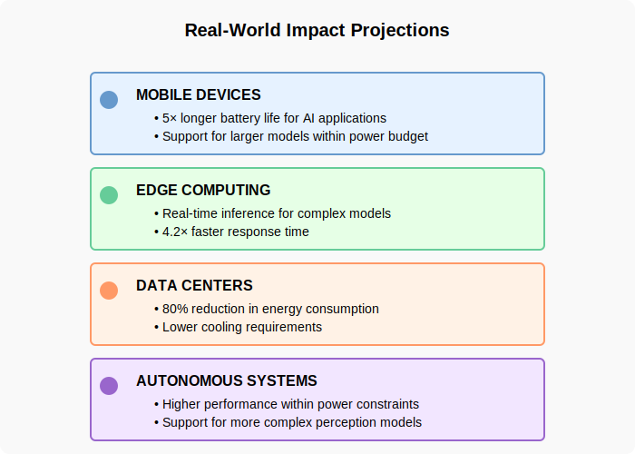

# Performance Results

Below are diagrams summarizing various energy and performance metrics.

## Energy Metrics

### Component Energy Reduction

*Diagram illustrating energy reduction at the component level.*

### Energy Delay Product (EDP)

*Graph showing improvements in the energy delay product (EDP) with various optimizations.*

### Energy Savings Breakdown

*Breakdown of energy savings across different optimization strategies.*

### Overall Energy Efficiency

*Chart summarizing the overall energy efficiency achieved by the accelerator.*

## Architecture Comparison

### Fixed Comparison

*Diagram comparing the fixed architecture parameters and performance across different designs.*

## Performance Metrics

### Performance by Layer

*Graph depicting the performance improvements across different neural network layers.*

### Real-world Impact

*Diagram illustrating the real-world impact of the accelerator’s performance enhancements.*