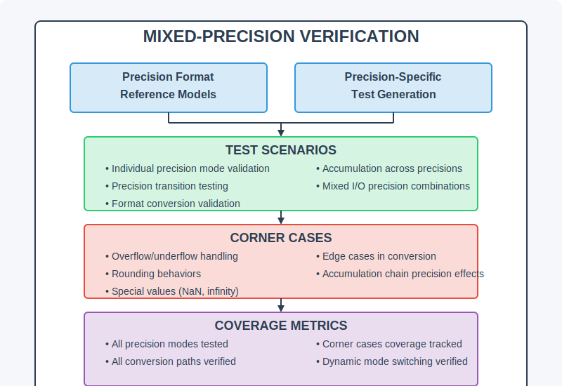
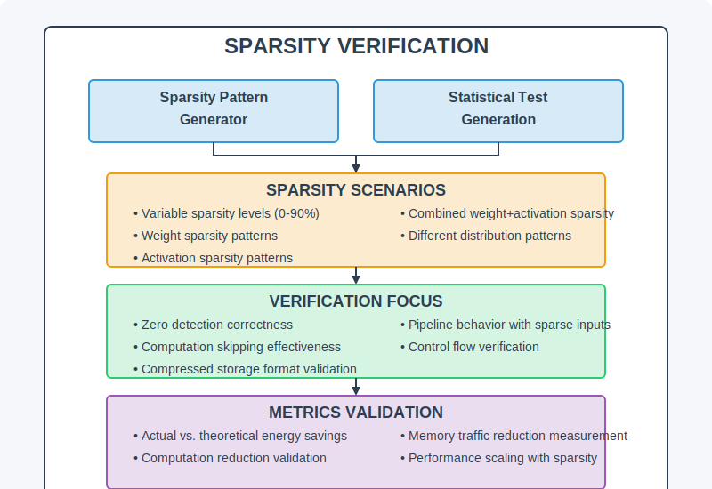
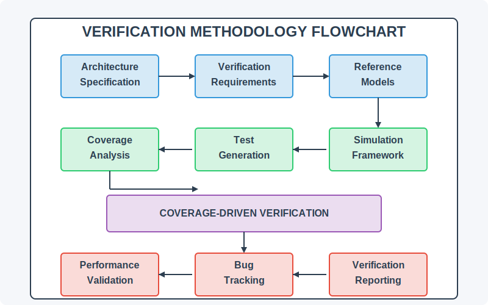
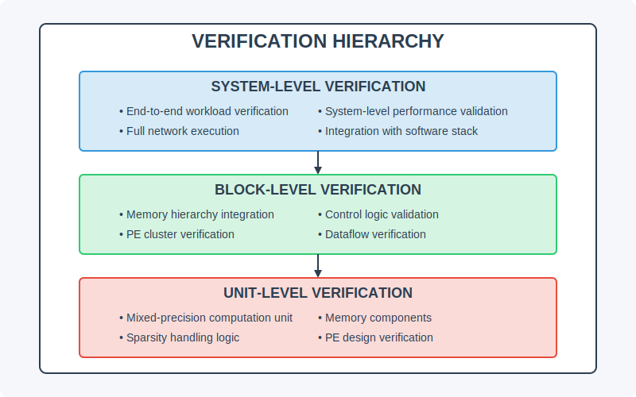
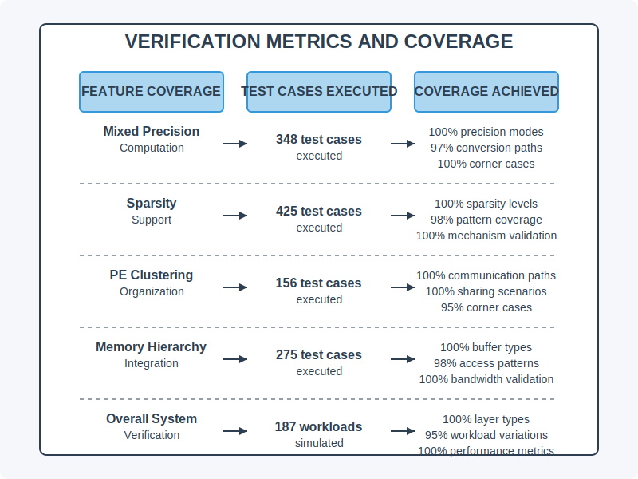

# Verification Methodology

Below are diagrams illustrating the verification process and metrics used for Eyeriss Ultra.

## Mixed Precision Verification

*Diagram showing the verification setup for mixed precision operations.*

## Sparsity Verification

*Diagram illustrating the verification process for sparsity exploitation techniques.*

## Verification Flowchart

*Flowchart detailing the steps in the verification process.*

## Verification Hierarchy

*Diagram outlining the hierarchical structure of the verification framework.*

## Verification Metrics

*Diagram displaying the metrics used to evaluate the verification outcomes.*